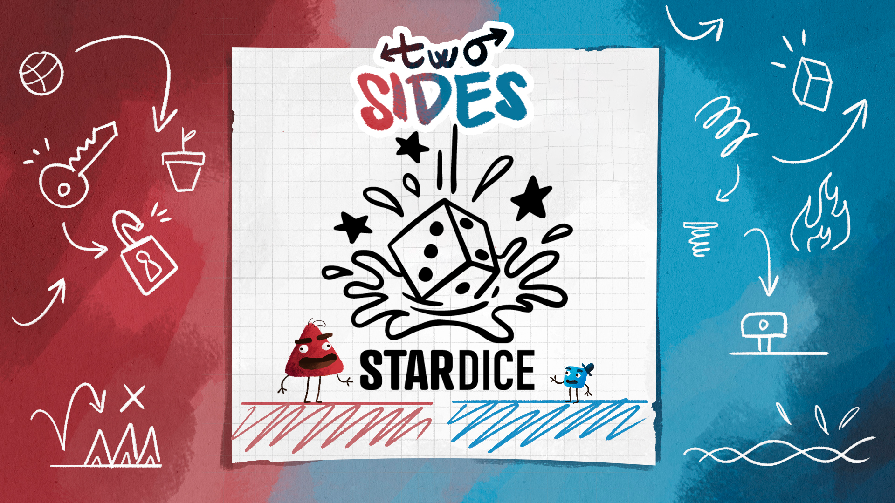
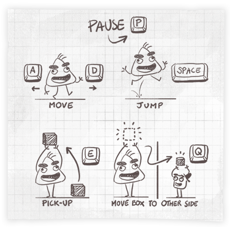
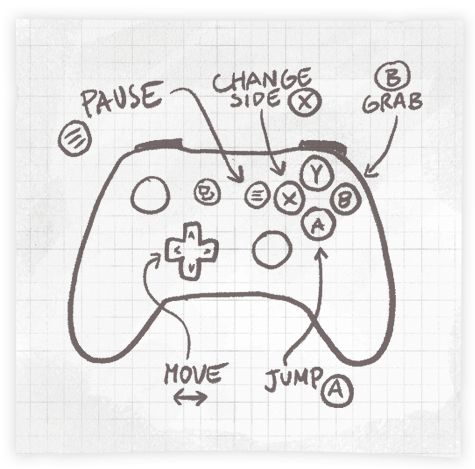

# 

<b>Two Sides</b> is a 2D puzzle platformer where you take turns controlling <b>Redd</b> and <b>Pixel</b>, each residing in a paper world that matches their respective sizes. They can only help each other out by transferring certain items across their worlds, and by doing so, resizing them back and forth to make Redd and Pixel's escape route clearer.

The game was made in 31 days during the <b>[Game Off 2023](https://itch.io/jam/game-off-2023)</b> jam, from 1 Nov 2023 to 1 Dec 2023, based on the theme “<i>Scale</i>”. Here is the game published on [Itch.io](https://stardice.itch.io/two-sides).

## Gameplay
* Control Redd and Pixel, the two characters of the game. Switch the control between them every time you need.
* Jump with the characters to reach higher platforms.
* Pick up objects and release them wherever needed, or transfer them to the other character. The transferred object fits the scale of the receiver.
* Unlock exit doors by pressing the button for the red side and getting the key for the blue side.
* Reach the unlocked exit doors with both characters to complete the level and start the next one.

## How to Play

## Requirements
If you want to open, edit or see the Godot project:
* Godot 4.1.2 (https://godotengine.org/)

## Credits
<I>All the assets were created from scratch during [Game Off 2023](https://itch.io/jam/game-off-2023), except for sound effects made using Freesound.org.</i>
### Team
💻 **Programmer**
* Simone Guidi: https://github.com/irafunesta / https://irafunesta.itch.io

📝 **Designers**
* Kevin Toninelli: https://github.com/spatagherru / https://spatagherru.itch.io
* Michele Buonocunto: https://github.com/MicheleBuonocunto / https://michele-buonocunto.itch.io/
* Mattia Solimeno: https://github.com/mattsoli / https://mattsoli.itch.io

🎨 **2D Artist**
* Samuele Prosser: https://github.com/PROXcode / https://prox-games.itch.io

🎹 **Music Composer**
* Claudio Monteleone: https://github.com/ForgottenDawn / https://forgottendawn.itch.io
